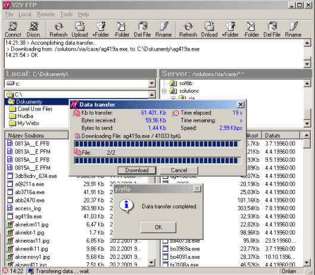



## Aesy ftp

### Description

Nearly done Ftp aplication made with Wininet.bas (Wininet.dll). It (multi)downloads,

(multi)uploads files, creates / removes folders, renames files, has progress bars, time

and transfer speed rate and many others more or less usefull windows and ftp functions.
 
### More Info
 

             |
---                |---
**Submitted On**   |2001-02-20 15:12:48
**By**             |[David Smejkal](https://github.com/Planet-Source-Code/PSCIndex/blob/master/ByAuthor/david-smejkal.md)
**Level**          |Intermediate
**User Rating**    |5.0 (327 globes from 66 users)
**Compatibility**  |VB 6\.0
**Category**       |[Complete Applications](https://github.com/Planet-Source-Code/PSCIndex/blob/master/ByCategory/complete-applications__1-27.md)
**World**          |[Visual Basic](https://github.com/Planet-Source-Code/PSCIndex/blob/master/ByWorld/visual-basic.md)
**Archive File**   |[CODE\_UPLOAD152442202001\.zip](https://github.com/Planet-Source-Code/david-smejkal-aesy-ftp__1-21186/archive/master.zip)

